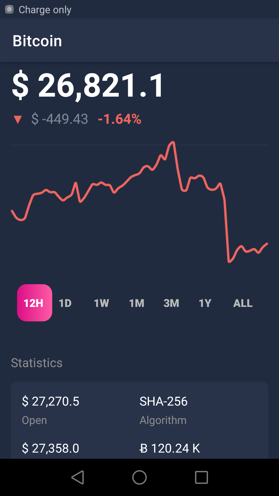

# Crypto Comparator
This application is for monitoring price changes of the top ten cryptocurrencies. It displays a chart of the price changes of each cryptocurrency over different time
intervals. If the price is rising, the chart is drawn in green and if it is falling, it is drawn in red. This application also has a section for news, which displays 
a random headline each time it is tapped. Additionally, by tapping on the speaker icon next to the news, the link to the news article opens for more details.
It is capable of being updated by pulling down the page. It also displays some statistical information such as the highest price of the day, etc.
   
   
   
